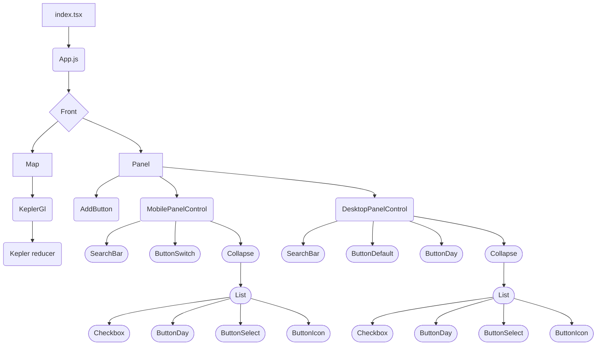

# English Documentation

[QuickStart](EN/quickstart.md)

## 🌍 Datatlas presentation

Datatlas aims to facilitate the display of various data sources on a map
The tool is based on kepler.gl which facilitates the processing of data sources in geojson/json/csv and the display of large data sources in webgl

## 📄 Datatlas Strucure

Datatlas is a backend capable of retrieving the following data sources:

- Notion Database ([View table notion structure](####Notion)) 
- Wordpress API ([View table structure wordpress](####Wordpress)) 
- Geojson ([See table structure geojson](####Geojson))

These data are stored in a file named LayersConfiguration.json

When the data sources are not formatted in geojson, the back applies a treatment of these data and formats it in a format specific to kepler.gl (the library used by the front to display the cartographic data)

The front draws the data from the back and displays it with kepler.gl
A new graphical layer specific to Datatlas is built on the basis of these data and allows to filter these same data on the map

## 🔩 Back

## 🗺 Front

The front is based on react and using the Kepler.gl Library

The components use the following structure
[NEEDS TO BE UPDATED]

### Data sources structure
The data sources do not have the same format, the back of datatlas comes to interface between the api of the source and the front in order to apply a treatment which is readable for the front

#### Notion 
the back is able to draw a notion table thanks to the id of a notion table and to export it in a json readable by kepler.gl

The back is able to process any notion table containing the following field types:

- date
- simple select
- multi-select
- short text
- long text
- email
- phone
- number

nevertheless some type of fields are mandatory or have some function once loaded on the front

- latitude and longitude : their name must not change to allow the correct display of points on the map
- icon : allows the display of an icon instead of the point on the map, by default use the list of icons provided by kepler.gl [see icons list](https://d1a3f4spazzrp4.cloudfront.net/kepler.gl/icons/svg-icons.json) , these icons can be customized [see icon customization ](###icone-personalized)
- image : allows the display of an image in the Front Panel. This text field must be named `image` and must contain a url to an image (https://monserveur/monimage.jpg)

Once your table is built and filled it is necessary to share it with your [integration notion](https://www.notion.so/my-integrations) and to include your notion api key in the environment variables of the back when it is deployed [See environment variables](####Environment-variables)

You will then have to add the table as a data layer in the back instance configuration file **LayersConfiguration.json**.

#### Wordpress 
Concerning the wordpress layers, the back will pull the data from the wordpress api and then format it to kepler.gl

**⚠ At this time the wordpress module is not modular and only works on specific use cases**

#### Geojson
Concerning the geojson format, the back does not apply any formatting of the data above, it only serves as a gateway between the data source and the front end, kepler.gl on the front end is able to process this data
Any geojson data source should be supported

### Configuration instance

### Deployment
#### Environment variables
**DATATLAS_BACK_END_PORT**
**NOTION_API_KEY**
**BEARER_TOKEN**

## Front
### Front structure
#### Sidepanel
#### Filter Panel
#### About Modal

### Personalized icons