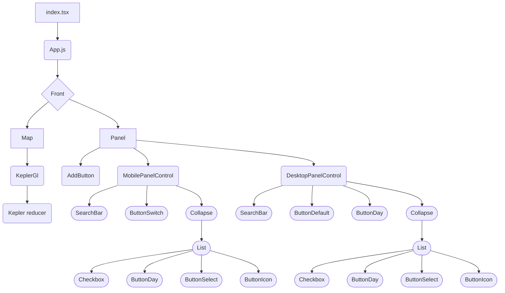

# 🗺 Front



### Structuration des sources de donnees
Les sources de données n'ayant pas les memes format, la back de datatlas vient s'interfacer entre l'api de la source et le front afin d'y appliquer un traitement qui soit lisible pour le front

#### Notion 
le back est capable grace à l'id d'une table notion de tirer une table notion et de l'exporter en un json lisible par kepler.gl

Le back est capable de traiter n'importe quelle table notion contenant les types de champs suivants :
- date
- simple select
- multi-select
- texte court
- texte long
- email
- telephone
- nombre

néanmoins certains type de champs sont obligatoires ou possèdent certaines fonction une fois chargés sur le front
- latitude et longitude : leurs nom ne doit pas changer permettent le bon affichage des points sur la carte
- icon : permet l'affichage d'une icone à la place du point sur la carte, par defaut utilise la liste d'icone fournie par kepler.gl [voir liste icones](https://d1a3f4spazzrp4.cloudfront.net/kepler.gl/icons/svg-icons.json) , ces icones peuvent êtres personnalisées [voir personalisation icone ](###icone-personalisees)
- image : permet l'affichage d'une image dans le sidepanel du Front. Ce champ de type texte doit être nommé `image` et doit contenir une url vers une images (https://monserveur/monimage.jpg)

Une fois votre tableau construit et remplis  il est nécessaire de le partager à votre [integration notion](https://www.notion.so/my-integrations)  et d'inclure votre clef api notion dans les variables d'environement du back à son deploiement [Voir variables d'environement](####Variables-d'environement)

Il faudra ensuite l'ajouter la table comme un layer de données dans le fichier de configuration d'instance du  back  **LayersConfiguration.json**

#### Wordpress 
Concernant les layers wordpress, le back va tirer les données de l'api wordpress et les formater ensuite au format kepler.gl

**⚠ A ce jour le module wordpress n'est pas modulaire et ne fonctionne que sur des cas d'usages precis**


#### Geojson
Concernant le format geojson, le back n'applique aucun formatage de données desssus, il ne sert que de passerelle entre la source de la donnée et le front, kepler.gl sur le front est en capacité de traiter ces données
N'importe quelle source de données en geojson devrait etre supportée

### Configuration instance
#### Les questions  à ce poser
Avant de configurer une instance quelques elements de réflexion en amont semblent necessaires
Elle sont formulées ci dessous

**Nom de votre instance ?**

**Quelles données ?** D'ou proviennent vos source de données (url)

**Quel format ?**  Seul le geojson et les database notion sont supportées pour le moment 
**Quel nom attribuer a vos données ?**

**Quels filtres souhaitez vous appliquer a ces données ?** Quels sont les element de filtrage que vous allez proposer a l'utilisateur

**Quels champs souhaitez vous afficher au clic d'un point sur la carte ?**

**De quelle couleur seront les points sur la carte liés a cette donnée ?**

**Quels champs souhaitez vous cacher par defaut sur la carte ?**

**Quel texte souhaiter vous afficher dans la modale "A Propos"** Un boutton d'information est proposé sur datatlas permettant de mettre en contexte vos données

**Avez vous du crowsourcing de prévu ? si oui souhaitez vous afficher des bouttons d'appel a contributions ?**

**Example**
Instance : Nature Lyon
Données :
  - Arbres d'alignement de la Métropole de Lyon 
    - [source de donnee](https://data.grandlyon.com/jeux-de-donnees/arbres-alignement-metropole-lyon/info)
    - format : geojson
    - nom : Arbres 
    - couleur : #108080
    - caché par defaut : Oui
    - filtres :
      - Essence
      - Annee plantation
    - champs a afficher :
      - Nom
      - Annee plantation
      - Essence
      - Description
  - Sentiers nature de la Métropole de Lyon 
    -  [source de donnee](https://data.grandlyon.com/jeux-de-donnees/sentiers-nature-metropole-lyon/info)
    - format : geojson
    - nom : Sentiers Nature
    - couleur : #dfff00
    - caché par defaut : Oui
    - filtres :
      - aucun
    - champs a afficher :
      - Nom
      - Titre
      - Adresse
Crowdsourcing :
  - texte : Ajoutez vous aussi vos sentiers
  - url : naturelyon.fr/ajout-sentier

A Propos :
```markdown
# Titre
## Sous titre
Texte de description
```

Avec une structuration de ce genre, il sere beaucoup plus facile de créer votre nouvelle instance

### Deployement
#### Variables d'environement
##### DATATLAS_BACK_END_PORT
##### NOTION_API_KEY
##### BEARER_TOKEN


## Front
### Structure du front
#### Sidepanel
#### Filter Panel
#### About Modal

### icone personalisees