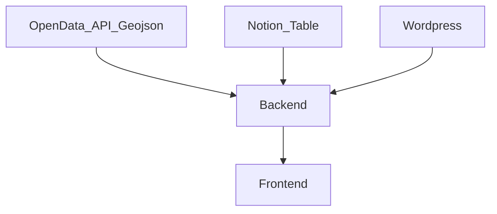

# Documentation de DATATLAS

# FR

## Presentation Datatlas

Datatlas a pour vocation de faciliter l'affichage de diverses sources de donnees sur une carte
L'outil se base sur kepler.gl qui facilite le traitement de source de donnes en geojson/json/csv et l'affichage de larges sources de donnees en webgl

## Structuration de datatlas

Datatlas est constitue d'un back en capacite de recuperer les sources de donnes suivantes :
- Table Notion ([Voir structure table notion](#### Notion)) 
- API Wordpress ([Voir structure table wordpress](#### Wordpress)) 
- Geojson ([Voir structure table geojson](#### Geojson))

Ces donnees sont stockees dans un fichier nomme LayersConfiguration.json

Lorsque les sources de donnees ne sont pas formatees en geojson, le back applique un traitement de ces donnees et le formate en un format propre a kepler.gl (la librairie utilise par le front pour afficher les donnes cartographiques)

Le Front vient lui tirer les donnees du back et les affiche avec kepler.gl
Un nouveau layer graphique propre a Datatlas est construit sur la base de ces donnes et permet de filtrer ces memes donnees sur la carte

## Back

### Structuration des sources de donnees
Les sources de donnees n'ayant pas les memes format, la back de datatlas vien s'interfacer entre l'api de la source et le front afin d'y appliquer un traitement qui soit lisible pour le front

#### Notion 
le back est capable grace a l'id d'une table notion de tirer une table notion et de l'exporter en un json lisible par kepler.gl

Le back est capable de traiter n'importe quelle table notion contenant les types de champs suivants :
- date
- simple select
- multi-select
- texte court
- texte long
- email
- telephone
- nombre

neanmoins certaines type de champs sont obligatoires ou possedent certaine fonction une fois chargees sur le front
- latitude et longitude : leurs nom ne doit pas changer permettent le bon affichage des points sur la carte
- icon : permet l'affichage d'une icone a la place du point sur la carte, par defaut utilise la liste d'icone fournie par kepler.gl [voir liste icones](https://d1a3f4spazzrp4.cloudfront.net/kepler.gl/icons/svg-icons.json) , ces icones peuvent etres personnalisees [voir peronalisation icone ](### icone personalisees)
- image : permet l'affichage d'une image dans le sidepanel du Front. Ce champ de type texte doit etre nomme image et doit contenir une url vers une images (https://monserveur/monimage.jpg)

Une fois votre tableau construit et remplis  il est necessaire de le partager a votre [integration notion](https://www.notion.so/my-integrations)  et d'inclure votre clef api notion dans les variable d'environement du back a son deployement [Voir variables d'environement](#### Variables d'environement)

Il faudra ensuite l'ajouter la table comme un layer de donnes dans le fichier de configuration d'instance du  back  **LayersConfiguration.json**

#### Wordpress 
Concernant les layers wordpress, le back va tirer les donnes de l'api wordpress et les formater ensuite au format kepler.gl

A ce jour le module wordpress n'est pas modulaire et ne fonctionne que sur des cas d'usages precis

#### Geojson
Concernant le format geojson, le back n'applique aucun formatage de donnes desssus, il ne sert que de passerelle entre la source de la donnes et le front, kepler.gl sur le front est en capacite de traiter ces donnees
N'importe quelle source de donnees en geojson devrait etre supportee

### Configuration instance

### Deployement
#### Variables d'environement
##### DATATLAS_BACK_END_PORT
##### NOTION_API_KEY
##### BEARER_TOKEN

## Front
### Structure du front
#### Sidepanel
#### Filter Panel
#### About Modal

### icone personalisees