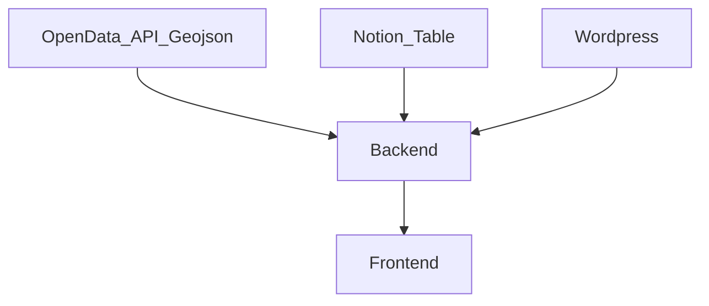
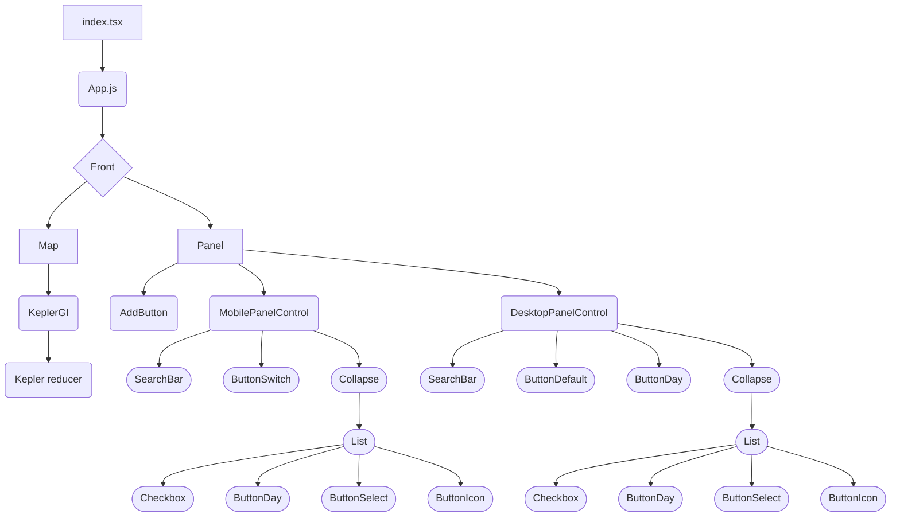

# Documentation de DATATLAS

- [Documentation de DATATLAS](#documentation-de-datatlas)
- [FR](#fr)
  - [🌍 Presentation Datatlas](#-presentation-datatlas)
  - [📄 Structuration de datatlas](#-structuration-de-datatlas)
  - [🔩 Back](#-back)
    - [Structuration des sources de donnees](#structuration-des-sources-de-donnees)
      - [Notion](#notion)
      - [Wordpress](#wordpress)
      - [Geojson](#geojson)
    - [Configuration instance](#configuration-instance)
    - [Deployement](#deployement)
      - [Variables d'environement](#variables-denvironement)
        - [DATATLAS_BACK_END_PORT](#datatlas_back_end_port)
        - [NOTION_API_KEY](#notion_api_key)
        - [BEARER_TOKEN](#bearer_token)
  - [Front](#front)
    - [Structure du front](#structure-du-front)
      - [Sidepanel](#sidepanel)
      - [Filter Panel](#filter-panel)
      - [About Modal](#about-modal)
    - [icone personalisees](#icone-personalisees)
# FR

## 🌍 Presentation Datatlas

Datatlas a pour vocation de faciliter l'affichage de diverses sources de données sur une carte
L'outil se base sur kepler.gl qui facilite le traitement de source de donnes en geojson/json/csv et l'affichage de larges sources de données en webgl

## 📄 Structuration de datatlas

Datatlas est constitue d'un back en capacité de recupérer les sources de données suivantes :
- Table Notion ([Voir structure table notion](####Notion)) 
- API Wordpress ([Voir structure table wordpress](####Wordpress)) 
- Geojson ([Voir structure table geojson](####Geojson))

Ces données sont stockées dans un fichier nommé LayersConfiguration.json

Lorsque les sources de donnees ne sont pas formatées en geojson, le back applique un traitement de ces données et le formate en un format propre à kepler.gl (la librairie utilisée par le front pour afficher les données cartographiques)

Le Front vient lui tirer les données du back et les affiche avec kepler.gl
Un nouveau layer graphique propre à Datatlas est construit sur la base de ces données et permet de filtrer ces memes donnees sur la carte

## 🔩 Back

## 🗺 Front

### Structuration des sources de donnees
Les sources de données n'ayant pas les memes format, la back de datatlas vient s'interfacer entre l'api de la source et le front afin d'y appliquer un traitement qui soit lisible pour le front

#### Notion 
le back est capable grace à l'id d'une table notion de tirer une table notion et de l'exporter en un json lisible par kepler.gl

Le back est capable de traiter n'importe quelle table notion contenant les types de champs suivants :
- date
- simple select
- multi-select
- texte court
- texte long
- email
- telephone
- nombre

néanmoins certains type de champs sont obligatoires ou possèdent certaines fonction une fois chargés sur le front
- latitude et longitude : leurs nom ne doit pas changer permettent le bon affichage des points sur la carte
- icon : permet l'affichage d'une icone à la place du point sur la carte, par defaut utilise la liste d'icone fournie par kepler.gl [voir liste icones](https://d1a3f4spazzrp4.cloudfront.net/kepler.gl/icons/svg-icons.json) , ces icones peuvent êtres personnalisées [voir personalisation icone ](###icone-personalisees)
- image : permet l'affichage d'une image dans le sidepanel du Front. Ce champ de type texte doit être nommé `image` et doit contenir une url vers une images (https://monserveur/monimage.jpg)

Une fois votre tableau construit et remplis  il est nécessaire de le partager à votre [integration notion](https://www.notion.so/my-integrations)  et d'inclure votre clef api notion dans les variables d'environement du back à son deploiement [Voir variables d'environement](####Variables-d'environement)

Il faudra ensuite l'ajouter la table comme un layer de données dans le fichier de configuration d'instance du  back  **LayersConfiguration.json**

#### Wordpress 
Concernant les layers wordpress, le back va tirer les données de l'api wordpress et les formater ensuite au format kepler.gl

**⚠ A ce jour le module wordpress n'est pas modulaire et ne fonctionne que sur des cas d'usages precis**

#### Geojson
Concernant le format geojson, le back n'applique aucun formatage de données desssus, il ne sert que de passerelle entre la source de la donnée et le front, kepler.gl sur le front est en capacité de traiter ces données
N'importe quelle source de données en geojson devrait etre supportée

### Configuration instance

### Deployement
#### Variables d'environement
##### DATATLAS_BACK_END_PORT
##### NOTION_API_KEY
##### BEARER_TOKEN

## Front
### Structure du front
#### Sidepanel
#### Filter Panel
#### About Modal

### icone personalisees