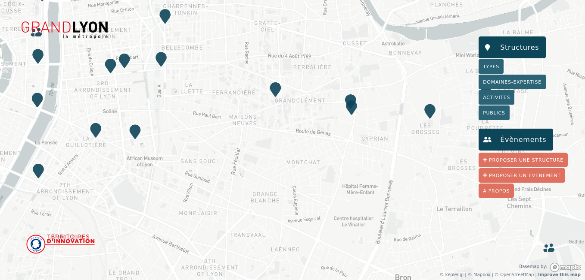
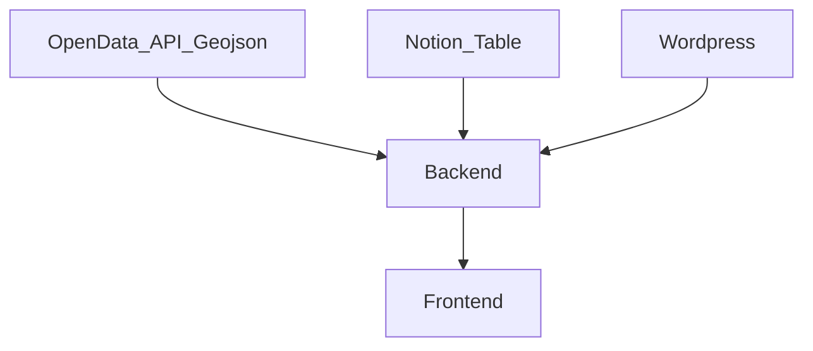

# Documentation de DATATLAS

- [Documentation de DATATLAS](#documentation-de-datatlas)
- [FR](#fr)
  - [🌍 Presentation Datatlas](#-presentation-datatlas)
  - [📄 Structuration de datatlas](#-structuration-de-datatlas)
  - [🔩 Back](#-back)
  - [🗺 Front](#-front)
  - [CI/CD](#cicd)
  - [Contribuer](#contribuer)
  - [Glossaire](#glossaire)
# FR

## 🌍 Presentation Datatlas

Datatlas a pour vocation de faciliter l'affichage de diverses sources de données sur une carte
L'outil se base sur kepler.gl qui facilite le traitement de source de donnes en geojson/json/csv et l'affichage de larges sources de données en webgl

A ce jours 3 instances sont deployées en experimentation 
- [Industries](industries-datatlas.datagora.erasme.org/) 
- [Manger Local](https://mangerlocal.grandlyon.com/)
- [Canographia](https://canographia.datagora.erasme.org/)
- 
## 📄 Structuration de datatlas

Datatlas est constitue d'un back en capacité de recupérer les sources de données suivantes :
- Table Notion ([Voir structure table notion](####Notion)) 
- API Wordpress ([Voir structure table wordpress](####Wordpress)) 
- Geojson ([Voir structure table geojson](####Geojson))

Ces données sont stockées dans un fichier nommé LayersConfiguration.json

Lorsque les sources de donnees ne sont pas formatées en geojson, le back applique un traitement de ces données et le formate en un format propre à kepler.gl (la librairie utilisée par le front pour afficher les données cartographiques)

Le Front vient lui tirer les données du back et les affiche avec kepler.gl
Un nouveau layer graphique propre à Datatlas est construit sur la base de ces données et permet de filtrer ces memes donnees sur la carte

## 🔩 Back

## [🗺 Front](front.md)

## [CI/CD](ci-cd.md)
Document expliquant les processus [d'integration et déployement continu](ci-cd.md)

## Contribuer 
Les [futures features](milestones.md) de prévues pour Datatlas

## [Glossaire](glossary.md)
Explication des termes propes a Datatlas utilisés dans la documentation